# Dragon Input Helper – Extension Chrome

> **Version 1.0** · **Manifest V3**

Permet à Dragon (ou à tout autre moteur de dictée s’appuyant sur les API d’accessibilité) de dicter du texte à l’intérieur des **iframes inter‑domaine** habituellement inaccessibles dans Chrome.

---
## Table des matières
1. [Motivation](#motivation)
2. [Fonctionnalités](#fonctionnalites)
3. [Architecture technique](#architecture-technique)
4. [Analyse fichier par fichier](#analyse-fichier-par-fichier)
5. [Séquence de messagerie](#sequence-de-messagerie)
6. [Installation](#installation)
   * [Chargement non empaqueté (développement)](#chargement-non-empaquete-developpement)
   * [Packaging pour le Chrome Web Store](#packaging-pour-le-chrome-web-store)
7. [Guide d’utilisation](#guide-dutilisation)
8. [Configuration & personnalisation](#configuration--personnalisation)
9. [Sécurité & vie privée](#sécurité--vie-privée)

---
## Motivation
Chrome bloque l’interaction directe avec les champs de saisie présents dans des **iframes de domaine différent** pour des raisons de sécurité (*same‑origin policy*). Dragon ne parvient donc pas à positionner le curseur ni à insérer le texte dicté. Cette extension sert de 'proxy' : elle ouvre une fenêtre contextuelle (*pop‑up*) appartenant au domaine principal, récupère le texte dicté, puis le réinjecte dans l’iframe via `chrome.scripting`.

---
## Fonctionnalités
* **Capture en un clic** : cliquez dans n’importe quel `<input>`, `<textarea>`(ou élément portant la classe `ft-search-application-input`) de la page ; la valeur courante est immédiatement extraite.
* **Éditeur contextuel** : une fenêtre pop‑up redimensionnable (`popup.html`) vous permet de dicter ou d’éditer sans perte de focus.
* **Messagerie bidirectionnelle** : utilisation de "event et messages chrome": script de contenu ➜ service‑worker d’arrière‑plan ➜ pop‑up ➜ arrière‑plan ➜ script de contenu.
* **Conforme au Manifest V3** : utilise un `service_worker` en arrière‑plan et évite les API obsolètes.
* **Permissions minimales** : uniquement `activeTab` et `scripting`.

---
## Architecture technique
### Extrait du manifest
```json
{
  "manifest_version": 3,
  "name": "Dragon Input Helper",
  "version": "1.0",
  "description": "Permet la dictée Dragon dans les iframes inter‑domaine.",
  "permissions": ["activeTab", "scripting"],
  "background": { "service_worker": "background.js" },
  "content_scripts": [{
    "matches": ["<all_urls>"],
    "js": ["content.js"],
    "all_frames": true
  }],
  "web_accessible_resources": [{
    "resources": ["popup.html", "popup.js"],
    "matches": ["<all_urls>"]
  }]
}
```

| Composant | Rôle |
|-----------|------|
| **content.js** | Injecté dans *chaque* frame. Détecte les clics, envoie le texte à l’arrière‑plan, reçoit le texte modifié. |
| **background.js** | Service‑worker unique. Mémorise l’onglet d’origine, ouvre/centre le pop‑up, relaie le texte final. |
| **popup.html / popup.js** | Interface affichée dans une fenêtre distincte (`type:"popup"`). Permet la saisie puis renvoie la chaîne finale. |

La communication utilise exclusivement `chrome.runtime.sendMessage`; aucun port n’est maintenu ouvert inutilement, ce qui laisse le worker éligible à la suspension.

---
## Analyse fichier par fichier
### `content.js`
* Variable de module `activeInput`.
* Intercepte les clics à la phase de *capture* (`useCapture=true`) afin de devancer les écouteurs du site.
* Cibles prises en charge :
  * `INPUT`
  * `TEXTAREA` *(sur la feuille de route)*
  * tout élément avec la classe `ft-search-application-input`.
* Au clic :
  1. Stocke la référence de l’élément.
  2. Lit sa propriété `.value`.
  3. Envoie `{action:"openPopupWithText", textToEdit}` à l’arrière‑plan.
* Écoute `{action:"insertText"}` ; si l’élément est toujours dans le DOM :
  1. Remplace la valeur.
  2. Déclenche un événement synthétique `input` pour notifier les frameworks.

### `background.js`
* Variables persistantes :
  * `originalTabId` – ID de l’onglet où le clic a eu lieu.
  * `popupWindowId` – ID Chrome de la fenêtre pop‑up si elle existe encore.
* Lorsqu’il reçoit `openPopupWithText` :
  1. Enregistre l’onglet d’origine.
  2. Construit une query‑string (`popup.html?text=<encodé>`).
  3. Si un pop‑up existe déjà, `chrome.windows.update` pour le focaliser ; sinon `chrome.windows.create`.
* Nettoie lorsqu’on ferme la fenêtre (`chrome.windows.onRemoved`).
* Quand le texte revient (`textFromPopup`) : relaie `{action:"insertText"}` vers l’onglet d’origine.
* Ecoute les pings de popup.js via chrome.runtime.onConnect.addListener((port).. qui assure son maintien opérationel (sinon se désactive au bout de 30 secondes)

### `popup.html` & `popup.js`
* HTML/CSS purs (aucun framework).
* Éléments principaux :
  1. `<textarea id="popupTextarea">` – extensible, occupe 100 % de la hauteur.
  2. `<button id="doneButton">Insérer le texte</button>` – valide.
  3. Le script importe `popup.js`.
* Logique dans `popup.js` :
  0. Ping background.js toutes les 15 secondes pour s'assurer de son maintient de statut actif avant l'envoit éventuel du message d'insertion du text.
  1. Lit le paramètre `?text=` et le place dans le textarea.
  2. Sur **Insérer le texte** : `chrome.runtime.sendMessage({action:"textFromPopup", text})`.
  3. Attend un court délai puis `window.close()`. **Délais très important pour que l'insertion sur la zone de text initiale fonctionne (le temps que la fenetre de base reprenne le focus)**

---
## Séquence de messagerie

```mermaid

sequenceDiagram
  participant U as Utilisateur
  participant CS as content.js
  participant BG as background.js
  participant PW as popup

  U ->> CS: clic dans <input>
  CS ->> BG: openPopupWithText(text)
  BG ->> PW: création / focus popup
  PW ->> BG: textFromPopup(text)
  BG ->> CS: insertText(text)
  CS ->> U: met à jour value

```


---
## Installation
### Chargement non empaqueté (développement)
1. Clonez ou dézippez **DragonIframeCompatibilityExtention‑main**.
2. Ouvrez `chrome://extensions`.
3. Activez le **mode développeur**.
4. Cliquez **Charger l’extension non empaquetée** puis choisissez le dossier racine.
5. Vérifiez que l’extension est **Activée**.

### Packaging pour le Chrome Web Store
```bash
zip -r dragon-input-helper-1.0.zip \
    manifest.json background.js content.js popup.html popup.js
```
Téléversez l’archive sur le tableau de bord développeur Chrome.

---
## Guide d’utilisation
1. Lancez Dragon et activez l’extension.
2. Cliquez dans le champ cible.
3. Éditez le texte dans le pop‑up et validez.

---
## Configuration & personnalisation
| Besoin | Action |
|--------|--------|
| Restreindre les domaines | Ajuster `manifest.json` |
| Support TEXTAREA | Modifier `content.js` |
| Taille du pop‑up | `background.js` |

---
## Sécurité & vie privée
Pas de stockage ni de trafic externes.

---